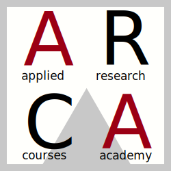

<!-- README.md is generated from README.Rmd. Please edit that file -->

# Open Science Tools

## Make your Scientific Research Accessible and Reproducible

<!-- badges: start -->
<!-- badges: end -->

## The Course

Researchers are disorganized and chaotic by nature. While this may be
the secret of their creativity, it can also lead to costly errors,
especially when it comes to coding. In this course, we will learn some
software development secrets and introduce coding good practices that
may save us lots of headaches. Only by following a structured approach
to coding can we ensure the reproducibility of our results and make
Science an open-source knowledge development!

### Materials

This is the main repository collecting all the slides and other
materials. For further details, see the course website at
<https://arca-dpss.github.io/course-open-scinence-prof/>.

## ARCA (Applied Research Courses Academy)

ARCA courses are advanced courses created by researchers for researchers
(and students). Learn and apply modern tools in your research. They are
organised by the Department of Developmental Psychology and
Socialisation at the University of Padua. At the link
[dpss.unipd.it/arca](https://www.dpss.unipd.it/arca) you can get
detailed information on all active courses.
